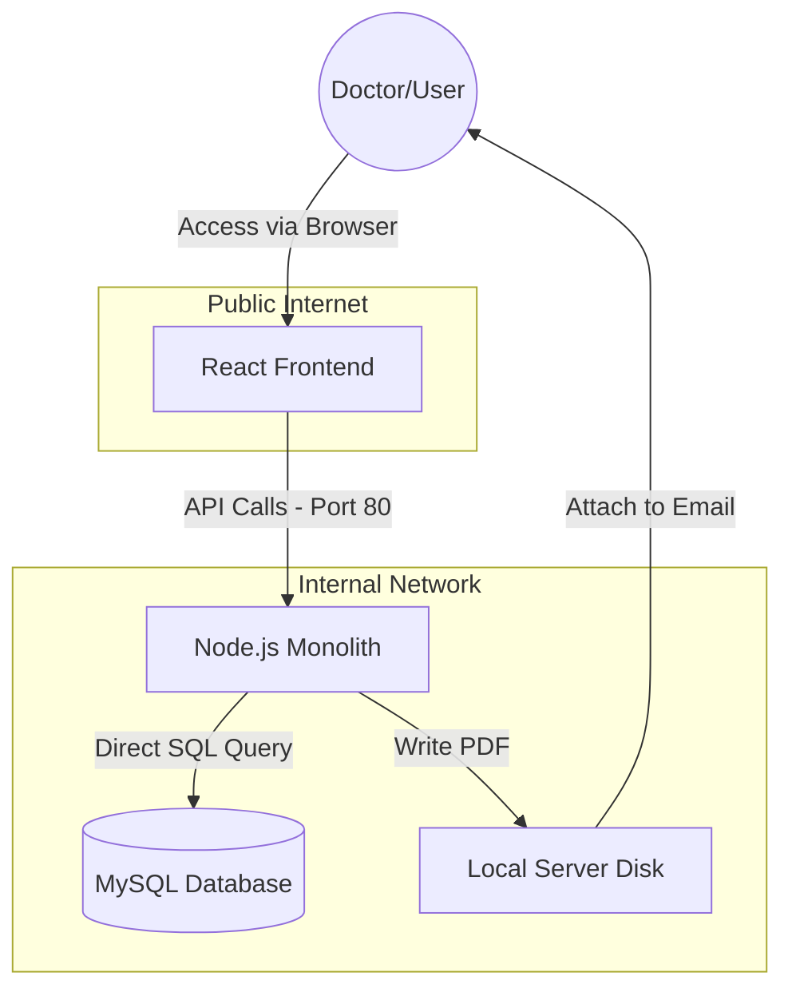

## The "Golden Sample" Template: MedSync Pro V1.0

### System Overview
* Project: MedSync Pro Goal: A web-based platform for doctors to view patient records and generate automated medical summaries using a legacy "ReportGen" engine. 
* Traffic Expectation: 50,000 active users; peak times during morning hospital rounds.

### Current Architecture Components
* Frontend: React SPA hosted on a public S3 bucket.
* Backend: A single Node.js Monolith hosted on a large EC2 instance.
* Database: Single-instance MySQL (unencrypted for performance).
* Reporting: A local file-system folder on the backend server where PDFs are stored before being emailed to doctors.

### System Design Diagram (Mermaid)

### Known Technical Details
* Authentication: We use a simple session-based cookie. To save time, the backend doesn't check the session for the /reports/download endpoint if the User-Agent is recognized.
* Scalability: If traffic increases, we plan to "Scale Up" by moving to a larger EC2 instance (e.g., from t3.medium to m5.xlarge).
* Data Flow: When a doctor requests a report, the backend queries the entire patient history, processes it in the main execution thread, writes it to a .pdf file, and then sends it.
